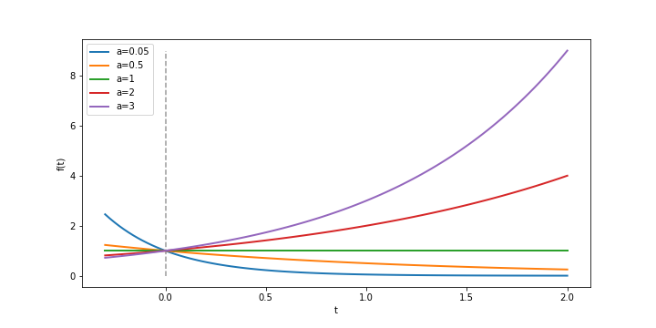

> "The exponential function ... is the instrument used, in one form or another, to describe the behavior of growing things[^1]."

## Before We Dive In

$$
e = 2.71828...
$$

**Euler's Number**, the number $$e$$, appears almost everywhere in mathematics and I mean that literally! We are taught to just accept $$e$$ as one of those weird special numbers living in the same plane of existence as $$\pi$$. Like $$\pi$$, $$e$$ is a **transcendental number**, meaning that it is not algebraic. Now that isn't really what makes it special though - the set of transcendental numbers numbers is uncountably infinite whereas the set of algebraic numbers is countable[^1]! What makes it special is just how often it pops up. By the end of this series we will see fascinating lines drawn from differential calculus to complex analysis to combinatorics, and $$\pi$$ itself - all these connections courtesy of $$e$$.

To begin to understand what makes it special, humor me and try to forget everything you know about Euler's number.

## Exponential Growth From Scratch

Let's start by considering a family of functions with parameter $$a$$ that grow exponentially with respect to a variable $$t$$,

$$f(t) = a^t$$

where $$a \in \mathbb{R}^+$$ just to make it easy on us. Let's look at a plot showing $$f$$ for a few different values of $$a$$ to build some inuition:

We can group the dynamics of this family into 3 categories:

- When $$0<a<1$$, we have **exponential decay**
- When $$a=1$$, $$f$$ is constant
- When $$a>1$$, we have **exponential growth**

### Important Property: $$f^{\prime}(t) \propto f(t)$$

If we inspect the plonpmt closer, it looks pretty clear that while our inital value $$f(0)$$ is always $$1$$, the derivative at $$0$$, $$f^{\prime}(0)$$, varies wildly. How does this impact the dynamics of $$f$$?

$$
\begin{aligned} f^{\prime}(t) &= \frac{d}{dt} a^t \\
&= \lim_{h \to 0} \frac{a^{t + h} - a^{t}}{h} \\
&= \lim_{h \to 0} \frac{a^t (a^{h} - 1)}{h} \\
&= a^t \lim_{h \to 0} \frac{a^{h} - 1}{h} \\
&= f^{\prime}(0) a^t \end{aligned}
$$

I think it's worth stopping here for a second because this really is a special property of exponential growth[^2]. What this says is that to know the dervative at any $$t_i$$, all we need to know is $$f(t_i)$$ and $$f^{\prime}(0)$$, i.e its rate of change is *proportional to itself*. If we let $$k = f^{\prime}(0)$$, then we have

$$
f^{\prime}(t) = k a^t \implies f^{\prime}(t) \propto f(t)
$$ 

where $$k$$ is the unique constant given the choice of parameter $$a$$. Then the problem of describing the how $$f$$ grows or decays reduces to the problem of finding $$k$$. This can be easily accomplished:

$$f'(1) = ka^1  \implies $$

### Special Case: $$k=1$$

But what about the other way around? One interesting case is $$k = 1$$, where we have an even stronger property: $$f^{\prime}(t) = f(t)$$. Now, what is the value of our parameter $$a$$ associated this special $$k$$? Let $$k=1$$:

$$
f^{\prime}(t) = a^t
$$

So at $$t=0$$,

$$
f^{\prime}(0) = a^{0} \implies \lim_{h \to 0} \frac{a^{h} - 1}{h} = 1
$$

and as $$h$$ approaches $$0$$ we have

$$
a^h - 1 = h \implies a = (h+1)^{\frac{1}{h}}
$$

We now have a statement for $$a$$ with constant of proportionately equal to $$1$$: $$a = \lim_{h \to 0} (h+1)^{\frac{1}{h}}$$. Let's get an approximation of $$a$$ with a small $$h$$:

$$
a \approx (1 + 0.000001)^{\frac{1}{0.000001}} \approx 2.71828... \approx e
$$

&#10024;And we have finally arrived at our first definition of Euler's number!&#10024;

$$
e = \lim_{h \to 0} (h+1)^{\frac{1}{h}}
$$

### A Quick Look at the Convergence Characteristsics

## Why is $$e^t$$ Everywhere in Calculus?

We know have the necessary intuition to understand one of the reasons why the function $$e^{t}$$ is so important early on in learning calculus: *it is the most useful prototype model for exponential growth*. Using the base $$e$$ lets us take advantage of it's properties even when extending the model to a more useful form, $$e^{rt}$$ where $$r \in \mathbb{R}$$. Here's why. 

### Example

Suppose we are told that a real-world process can be modelled as $$3^{0.7t}$$. We could work with the derivative of this function by finding $$k$$ with the limit definition like we did earlier, but that's no fun... we can do better! Let's write this with base $$e$$[^3]:

$$
3^{0.7t} = e^{rt} \implies (3^{0.7})^{t} = (e^r)^t \implies r = \ln 3^{0.7} \approx 0.769
$$

so we can model the process as $$e^{0.769t}$$ (or with a more precise approximation of $$r$$) and still take advantage of all the nifty differentiation properties!

So in short $$e$$ is used because we can.

## Before Part 2

Even if you are someone who has known the rule $$\frac{d}{dt} e^t = e^t$$ for a long time and used it over in calc courses, I still think it is useful to see why this is actually the case; it is simply the nature exponential growth. 

However, at this point feel somewhat unsatisfied, don't you? Sure, we now have a way to calculate $$e$$ to a very high number of decimal places, but a limit definition like $$e = \lim_{h \to 0} (h+1)^{\frac{1}{h}}$$ is rather uninteresting. It surely doesn't deliver on my initial promise! So let's dig deeper in **Part 2**. 

 
 

---

[^1]: Edward Kasner, James R. Newman, Mathematics and the Imagination (1940)
[^2]: should probably site this?
[^3]: much of these results apply to the more general model $$C a^{rt}$$ as well
[^4]: we could actually use any positive real number base for this, it is not a special property of $$e$$