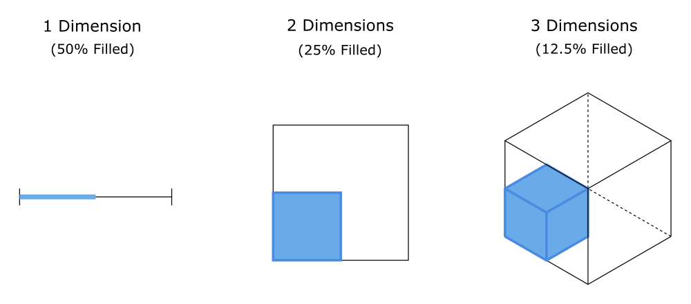

### Volumes in Higher Dimensions

Let's take a look at a simple illustration of where our intuition begins to fail us in high dimensions[^1]. 
We start with the unit interval, 
and highlight a subinterval with one endpoint at $0$ and the other at $\frac{1}{2}$. We can see clearly that the highlighted interval is
$\frac{1}{2}$ of the total length. Easy enough? 

Now let's move on to 2 dimensions, and consider a square with sides of unit length. Extending the experiment, we highlight the square region 
covered from $(0,0)$ to $(0,\frac{1}{2})$ and $(0,0)$ to $(\frac{1}{2},0)$. This time, the highlighted area covers $\frac{1}{4}$ of the total area.

In 3 dimensions, we can now see the pattern. The highlighted volume only accounts for $\frac{1}{8}$ of the total volume of the unit cube.

[^1]: Based on an example from Michael Betancourt's excellent paper *A Conceptual Introduction to Hamiltonian Monte Carlo* available [here](https://arxiv.org/abs/1701.02434)

